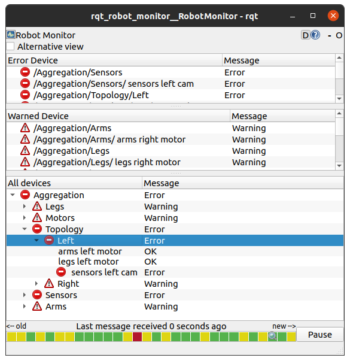

General information about this repository, including legal information and known issues/limitations, are given in [README.md](../README.md) in the repository root.

# The diagnostic_aggregator package
This package contains the `aggregator_node`.
It listens to the [`diagnostic_msgs/DiagnosticArray`](https://index.ros.org/p/diagnostic_msgs) messages on the `/diagnostics` topic and aggregates and published them on the `/diagnostics_agg` topic.

One use case for this package is to aggregate the diagnostics of a robot.
Aggregation means that the diagnostics of the robot are grouped by various aspects, like their location on the robot, their type, etc.
This will allow you to easily see which part of the robot is causing problems.

## Example
In our example, we are looking at a robot with arms and legs.
The robot has two of each, one on each side.
The robot also 4 camera sensors, one left and one right and one in the front and one in the back.
These are all the available diagnostic sources:

``` 
/arms/left/motor
/arms/right/motor
/legs/left/motor
/legs/right/motor
/sensors/left/cam
/sensors/right/cam
/sensors/front/cam
/sensors/rear/cam
```

We want to group the diagnostics by
- all sensors
- all motors
- left side of the robot
- right side of the robot

We can achieve that by creating a configuration file that looks like this (see [example_analyzers.yaml](example/example_analyzers.yaml)):
``` yaml
analyzers:
  ros__parameters:
    path: Aggregation
    arms:
      type: diagnostic_aggregator/GenericAnalyzer
      path: Arms
      startswith: [ '/arms' ]
    legs:
      type: diagnostic_aggregator/GenericAnalyzer
      path: Legs
      startswith: [ '/legs' ]
    sensors:
      type: diagnostic_aggregator/GenericAnalyzer
      path: Sensors
      startswith: [ '/sensors' ]
    motors:
      type: diagnostic_aggregator/GenericAnalyzer
      path: Motors
      contains: [ '/motor' ]
    topology:
      type: 'diagnostic_aggregator/AnalyzerGroup'
      path: Topology
      analyzers:
        left:
          type: diagnostic_aggregator/GenericAnalyzer
          path: Left
          contains: [ '/left' ]
        right:
          type: diagnostic_aggregator/GenericAnalyzer
          path: Right
          contains: [ '/right' ]
```

Based on this configuration, the [rqt_robot_monitor](https://index.ros.org/p/rqt_robot_monitor) will display the diagnostics information in a well-arranged manner as follows:


Note that it will also display the highest state per group to allow you to see at a glance which part of the robot is not working properly.
For example in the above image, the left side of the robot is not working properly, because the left camera is in the `ERROR` state.

# Analyzers
The `aggregator_node` will load analyzers to process the diagnostics data.
An analyzer is a plugin that inherits from the [`diagnostic_aggregator::Analyzer`](include/diagnostic_aggregator/analyzer.hpp) class.
Analyzers must be implemented in packages that directly depend on [`pluginlib`](https://index.ros.org/p/pluginlib) and `diagnostic_aggregator`.

The [`diagnostic_aggregator::Analyzer`](include/diagnostic_aggregator/analyzer.hpp) class is purely virtual and derived classes must implement the following methods:

- `init()` - Analyzer is initialized with base path and namespace
- `match()` - Returns true if the analyzer is interested in the status message
- `analyze()` - Returns true if the analyzer will analyze the status message
- `report()` - Returns results of analysis as vector of status messages
- `getPath()` - Returns the prefix path of the analyzer (e.g., "/robot/motors/")
- `getName()` - Returns the name of the analyzer (e.g., "Motors")

Analyzers can choose the value of the error level of their output.
Usually, the error level of the output is the highest error level of the input.
The analyzers are responsible for setting the name of each item in the output correctly.

# Using the aggregator_node

## Configuration

The `aggregator_node` can be configured at launch time like in this example:
``` yaml
pub_rate: 1.0 # Optional, defaults to 1.0
base_path: 'PRE' # Optional, defaults to ""
analyzers:
  motors:
    type: PR2MotorsAnalyzer
  joints:
    type: GenericAnalyzer
    path: 'Joints'
    regex: 'Joint*'
```

The `pub_rate` parameter is the rate at which the aggregated diagnostics will be published.
The `base_path` parameter is the prefix that will be added to the name of each item in the output.

Under the `analyzers` key, you can specify the analyzers that you want to use.
Each analyzer must have a unique name.
Under the name, you must specify the type of the analyzer.
This must be the name of the class that implements the analyzer.
Additional parameters depend on the type of the analyzer.

Any diagnostic item that is not matched by any analyzer will be published by an "Other" analyzer.
Items created by the "Other" analyzer will go stale after 5 seconds.

## Launching
You can launch the `aggregator_node` like this (see [example.launch.py.in](example/example.launch.py.in)):
``` python
    aggregator = launch_ros.actions.Node(
        package='diagnostic_aggregator',
        executable='aggregator_node',
        output='screen',
        parameters=[analyzer_params_filepath])
    return launch.LaunchDescription([
        aggregator,
    ])
```

# Basic analyzers
The `diagnostic_aggregator` package provides a few basic analyzers that you can use to aggregate your diagnostics.

## GenericAnalyzer
The [`diagnostic_aggregator::GenericAnalyzer`](include/diagnostic_aggregator/generic_analyzer.hpp) class is a basic analyzer that can be configured to match diagnostics based on their name.
By defining a `path` parameter, you can specify the prefix that will be added to the name of each item in the output.
This way you can group diagnostics by their location or other aspects as demonstrated in the [example](#example).

## AnalyzerGroup
The [`diagnostic_aggregator::AnalyzerGroup`](include/diagnostic_aggregator/analyzer_group.hpp) class is a basic analyzer that can be configured to group other analyzers.
It has itself an `analyzers` parameter that can be filled with other analyzers to group them.

An example of this is (see [example_analyzers.yaml](diagnostic_aggregator/example/example_analyzers.yaml)):
``` yaml
    topology:
      type: 'diagnostic_aggregator/AnalyzerGroup'
      path: Topology
      analyzers:
        left:
          type: diagnostic_aggregator/GenericAnalyzer
          path: Left
          contains: [ '/left' ]
        right:
          type: diagnostic_aggregator/GenericAnalyzer
          path: Right
          contains: [ '/right' ]
```

## DiscardAnalyzer
The [`diagnostic_aggregator::DiscardAnalyzer`](include/diagnostic_aggregator/discard_analyzer.hpp) class is a basic analyzer that discards all diagnostics that match it.
This can be useful if you want to ignore some diagnostics.

## IgnoreAnalyzer
The [`diagnostic_aggregator::IgnoreAnalyzer`](include/diagnostic_aggregator/ignore_analyzer.hpp) will ignore all parameters in its namespace and not match anything.

The difference between the `DiscardAnalyzer` and the `IgnoreAnalyzer` is that the `DiscardAnalyzer` will match diagnostics and discard them, while the `IgnoreAnalyzer` will not match anything.
This means that things that are ignored by the `IgnoreAnalyzer` will still be published in the "Other" analyzer, while things that are discarded by the `DiscardAnalyzer` will not be published at all.

# ROS API
 ## `aggregator_node`

### Subscribed Topics
- `diagnostics` ([diagnostic_msgs/DiagnosticArray](https://index.ros.org/p/diagnostic_msgs)) - The diagnostics to be aggregated

### Published Topics
- `diagnostics_agg` ([diagnostic_msgs/DiagnosticArray](https://index.ros.org/p/diagnostic_msgs)) - The aggregated diagnostics
- `diagnostics_toplevel_state` ([diagnostic_msgs/DiagnosticStatus](https://index.ros.org/p/diagnostic_msgs)) - The highest state of the aggregated diagnostics

### Parameters
- `pub_rate` (double, default: 1.0) - The rate at which the aggregated diagnostics will be published
- `base_path` (string, default: "") - The prefix that will be added to the name of each item in the output
- `analyzers` (map, default: {}) - The analyzers that will be used to aggregate the diagnostics

# Tutorials
TODO: Port tutorials #contributions-welcome